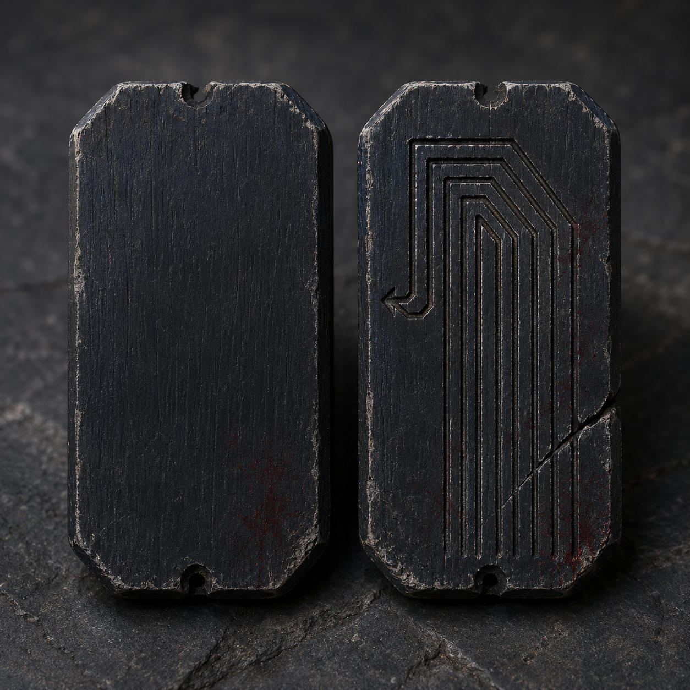

# 第55章 先问井底谁欠路

井底那句“韩家的人，先把路还来”落下时，第一层石台上的风倒卷。

陆遥脚边的焦木被风掀起，三道旧剑痕里同时冒出黑砂。黑砂没有落地，反而沿着石台边缘向下爬，像一群急着找债主的小虫。韩照夜刚要拔剑，脚下的断金线便猛地一紧，右膝旧伤当场软了半寸。

“先别砍。”陆遥按住她的剑鞘，“它在找路，不是在找人。”

“你连井里的风都认识？”

“不认识。”陆遥咳出血沫，“但它要找人，刚才就该先叫韩百川。”

黑砂爬到石台中央，拼出一条歪斜的线。线的尽头不是井底，而是两人身后的旧索。旧索上还挂着甲七舟的木屑，风一吹，木屑便发出一长两短的敲击。

沈雁回的声音从上方传来：“陆遥，第三道门齿开始合了！再下一次，我就割索！”

陆遥抬头，只看见折成七层的井壁和一线船腹。旧索正在收缩，韩照夜背后的木牌金线却往井下延伸。她若继续下去，甲七舟会把“韩家领路”写成整条旧路；他若现在回头，门齿会把沈雁回和四名收网人一起压进船腹。

“韩姑娘，井底催债，你家准备怎么还？”陆遥问。

“先问债主是谁。”

“债主已经写了韩百川。”

“那是甲七舟写的，不是我认的。”韩照夜抬眼，“我认韩家欠过路，不认它替我挑路。”

她说完，剑鞘重重一顿。那股缠在她脚下的金线被压进石台，井壁立刻传来一声闷响。黑砂凝成一块黑木牌，牌面只有一个“还”字，背面却刻着密密麻麻的折线。

黑木牌的用途很直白：这就是回程骨牌，能把被折风井打散的旧路暂时拼成可走方向；拼错会把承力点送回原处，先让持牌人挨一次回风。

陆遥捡起木牌，牌面一热，右胸的血立刻往外涌。他顺着背面折线看了两息，发现七条线里有六条都在向下，只有最细的一条折回左侧石台。第九程不是数字牌号，而是甲七舟账上把旧路送进折风井的一段路名；眼下这道折回线，就是它仍没被井风吞掉的部分。

“这东西在骗人？”韩照夜问。

“不，它只告诉我们哪条路还能走。”陆遥把木牌递给她，“真正的去处，得自己选。”

韩照夜没有接：“你看见的路，你走。”

“我右臂不能发力，你右膝不能久站。咱们两个都适合当路牌，挂墙上供人参考。”

上方又传来一声巨响，旧索骤然下沉，陆遥手背的第三行金线被扯出血口。井壁上方随即落下一块被风磨薄的路牌，牌上钉着三枚反光鳞甲。

“是试令司留下的东西。”她说。

那三块反光鳞甲能各偏开一次剑气；缚风索就是锁飞行轨迹且怕火的绳索，那场围猎里已碎一块；剩下两块最多各替他们偏开一剑。缚风索还锁在甲七舟外侧，没有火可用。

黑影撞向韩照夜。她横剑格挡，剑气被第一块鳞甲偏到井壁，黑石炸开一道口子。第二道风刃紧跟着压来，陆遥扯住她的剑鞘，用破损的折云翼贴着侧风转身，带她滚进左侧石台。

“你不是说不能正面硬撞？”

“我没撞它。”陆遥按住右胸，“是它撞我，我只是负责不站原地。”

黑影擦过石台，露出路牌底下的一截人骨。骨上缠着细金线，线头正连着韩照夜木牌背面的“领路”二字。

“那是韩百川带回来却没带回去的人。”韩照夜盯着白骨，声音发紧。

“只能证明他来过，不能证明他把谁送进去了。”陆遥把回程骨牌贴在石台折线处，“你要认韩家欠路，可以。但先把证据和债主分开，别让一块骨头替活人签字。”

骨牌贴上石台的刹那，七条折线中最细的一条亮了起来。井底风声立刻改向，原本向下的气流被拧成一道斜坡，通向第三层石台。与此同时，韩照夜脚下的金线却向反方向收紧，像有人要把她钉在第一层。

“路拼出来了，领路人却被扣住。”韩照夜咬牙。

“所以你先走。”

“你呢？”

陆遥解下缚风索的索头。跨章再用前，他先看了一眼那条布满裂纹的索身：“这玩意儿锁的是飞行轨迹，怕火；现在没火，我就让它锁自己的回头路。”折云翼还只能贴侧风转向，不能升高，也不能正面硬撞；他便把索头交给风路，不让破翼去扛门。

他把索头穿过回程骨牌，再钉进第一层石台的旧金线。骨牌拼出的斜风把索身绷直，缚风索果然沿着旧轨迹回收，索头没有去追韩照夜，反而把那条缠在她脚下的金线拽出石台。

“走！”

韩照夜借斜风跃上第三层石台。她落地时右膝一软，却用剑鞘撑住没有跪下。陆遥紧跟着踏入风坡，回程骨牌却忽然裂了一道缝，牌背六条向下的折线同时亮起。

“陆遥！”韩照夜回身。

“别回头！”

他看见那不是骨牌坏了，而是井底有人在改路。六条假路一齐张开，风压从四面合拢，像要把两人重新送回甲七舟。陆遥咬牙把骨牌翻面，用带血的拇指按住唯一的回折线。

“甲七舟要的是领路人，不是路。”他朝井底喊，“那就先把领路人还给韩家！”

井底沉默了一息。

回程骨牌猛地发出一声脆响，假路全部闭合。缠在韩照夜木牌上的金线被折回，连同“韩家领路”四字一起剥落半边。第三层石台下方，黑暗里露出一道更窄的门，门上刻着第九程。

韩照夜看着那道门：“它退了一步。”

“不是退，是怕我们把它的路牌挂回甲七舟。”陆遥把裂开的骨牌塞进怀里，掌心立刻被回风割开，“这东西能拼路，但只能拼出一条，错一次就会把人送回原处。”

“那也够了。”

“够不够，要看门后欠谁。”

上方传来沈雁回的喊声：“门齿停了！但船上多出一块牌，写着——公开验路，韩家先走！”公开风台，就是让甲七舟上所有人都能看见并判断谁在领路的空中台面；这块牌要把韩家的旧账摊到众人眼前。

陆遥和韩照夜对视一眼。

韩照夜握紧剑鞘：“甲七舟要在所有人面前让我认路。”

陆遥咧嘴：“那就让它当众把账单念完。欠路的是韩百川，挨剑的是韩家，至于谁领路——”

他抬脚踏上第九程石门前的第一块黑石。

“让评论区先替咱们起个外号。是‘韩家领路人’，还是‘甲七舟代驾’？两个都不够损，诸位读者老爷自己补第三个。”

石门上的“第九程”缓缓亮起，井底男声却没有回答韩照夜，只对着陆遥说道：

“代签者，先验你的路。”

陆遥手里的回程骨牌再次发热。牌背最后一条没有写向井底，而是穿过黑石井壁，指向甲七舟船外一片正在成形的公开风台。

---

## Metadata

- chapter_number: 55
- word_count: 2400
- generated_at: 2026-08-25 22:45 +08:00
- upload_status: not_uploaded
