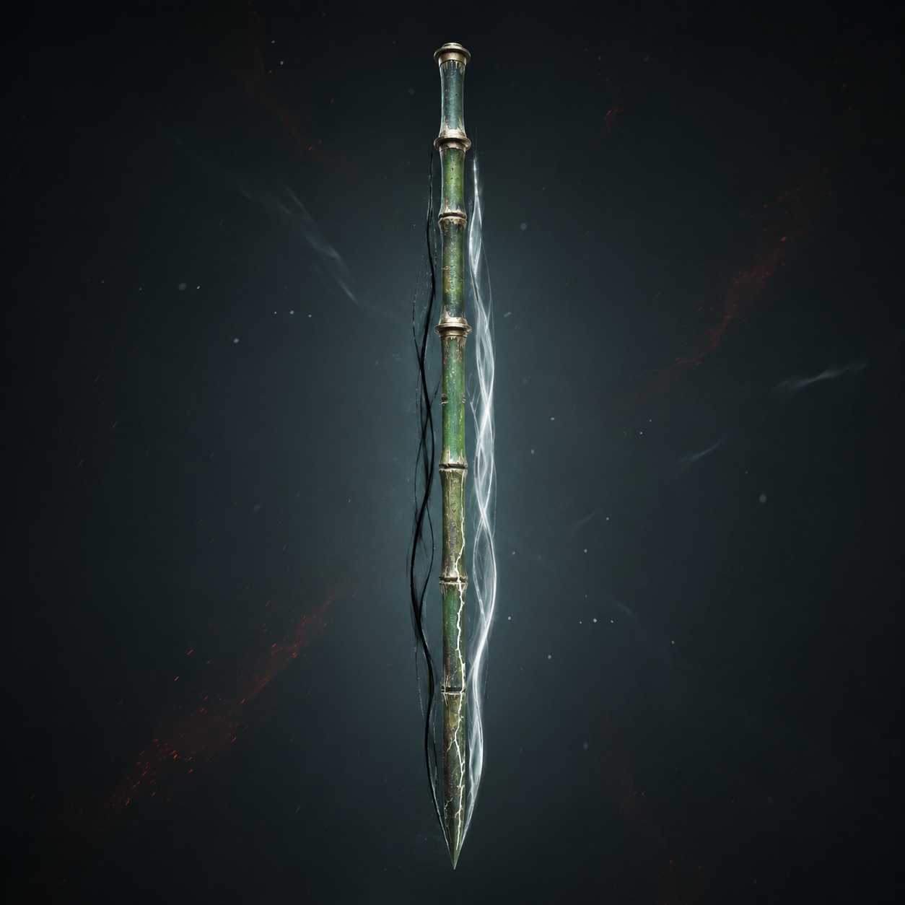

# 第56章 两条风线先走哪条

井门上的“第九程”刚刚暗下去，陆遥脚下的石台便向外翻了一寸。

他一手撑住黑石，一手按着胸口。血还在往外渗，右臂不能发力，回程骨牌贴在第三层石台边缘，裂缝里卡着一粒黑砂。韩照夜站在他前面，剑尖指着井底那道窄门，右膝旧伤被回风压得发颤，却没有退。

“代签者，先验你的路。”井底男声说，“韩家领路，不能带一个走错路的人。”

“你们这井收账，连伤员也要先做入职体检？”陆遥抬头，“那我问一句。验错了，谁赔医药费？”

没有回答。石台下却传来一声长、两声短的敲击。黑砂顺着旧路牌的焦痕爬动，聚成两条细线：一条向下，一条折向左侧更黑的井壁。

陆遥看了两息，指尖在左线旁停住：“回程骨牌能把折散的旧路暂时拼回方向。可它已经裂了，拼错会把承力点送回原处。刚才它把我们推回甲七舟，不是失灵，是这口井在换路。”

“所以你还要用？”韩照夜问。

“不用，我们站在这里等门把账算到骨头里。用，至少能选一次。”

他话音刚落，韩照夜忽然抬剑。

剑锋没有对准井门，而是劈向自己脚边的旧金线。金线应声弹起，像一条被踩疼的蛇，缠上她的剑鞘。她右膝一软，剑尖却顺着弹力刺入石台，硬生生把自己钉住。

陆遥看见了她的选择：她不是要砍断线，她要用剑鞘把线的回弹引进石台。线若断，甲七舟会把上面的人和桥一起压下来；线若留着，井底就能继续拿她的名字试路。

“韩姑娘，你这是认账，还是拿自己当账本？”

“先让它记住我。”她咬着牙，“记住我走过哪条路。”

井底的风突然收紧。韩照夜右膝旧伤猛地一沉，剑鞘上的裂纹向两边爬。陆遥伸手去扶，第三行金线立刻从他手背钻出，贴上她的剑柄。

“别碰！”韩照夜喝道。

晚了。金线把两人的重心拽成一条斜线，旧路牌上的黑砂同时涌向陆遥。那股力不是要拉他下井，而是要让他替韩照夜先走那条左折的假路。

陆遥咬住牙，脑中闪过“败中见隙”。那道命痕能在真实受伤后看见对手下一次动作的破绽，可他试用次数早已归零，右膝的镜像痛也不是现在能再借的东西。他没有把不能用的东西当救命绳，反而盯住自己脚下的石屑。

黑砂每次向左折，最外一粒都会先停一下；停住的位置，正好压在第三块石台的空缝上。假路不是没有路，它只是把每一次承力都藏在下一块石台。

“照夜，别退！”陆遥喊，“左路是真的，折回线才是假的。你把剑鞘压住金线，我去钉第三块空缝！”

“你右手不能发力。”

“我还有左手，穷人的手也算手。”

他没有拔剑。残竹剑第七节已经白裂，剑尾铜抱箍也崩了，再直冲一次，剑身会从中间断开。陆遥把回程骨牌夹在左掌与石台之间，先直说它的用途：“骨牌只负责拼回一条暂时能走的旧路，不负责替人选路。”

骨牌受压发热，背面的六条下折线一齐亮起。第一条把黑砂送回原处，第二条把风压推向井壁，到了第三条，裂缝骤然张开。

陆遥左掌被割出血，仍把骨牌往空缝里塞。石台没有合拢，反而露出一小截焦黑木槽。

“看见了！”沈雁回的声音从上方传来，“那不是路牌，是剑炉的引火槽！”

陆遥抬头，只看见甲七舟边缘垂下的旧绳和一块摇晃的木板。沈雁回没有下井，他把修索骨锥横插进船板，另一端勾住了移动的门齿。四名收网人压在他身后，没人听他的命令，却都在用肩膀顶住同一根绳。

“我只能给你三息！”沈雁回吼，“再久，船会把我们一起拽下来！”

韩照夜的剑鞘裂声越来越密。她忽然松开右手，任剑柄落地，改用左肩压住金线。那不是陆遥叫她做的，她自己换了能承受的姿势。

井底男声第一次变了调：“领路人不得改写承力点。”

“我改的是姿势。”韩照夜喘着气，“账还是我的。”

陆遥借这句话把残竹剑横过来。剑身不能再直冲，可横着便能把引火槽里的铁屑拨开。槽底藏着一枚灰白色的炉芯，只有拇指大，外壳刻着两道并行的细槽。

“这是移动点火芯。”他看了一眼便说，“用途是把三足温风小炉的火点带走，让炉子不用固定在原处；两道槽只能预存两条风线，走错一条，火会先烧回自己。”

他把炉芯扣进三足小炉底部。炉子原本只能在桥边升温，炉脚立刻弹出三枚短钉，钉住石台；炉盖裂纹里喷出的火舌没有冲人，反而沿着两条风线向左右分开，照亮了两条路。

第一条路通向井底，风稳，却没有回声。

第二条路折向左侧，风乱，石壁里却传来一长两短的敲击。

陆遥刚要说话，韩照夜已看向第二条路：“那边有人。”

“也可能是井在学人敲。”

“那就让它学到疼。”

她一脚踩住剑鞘，用空着的左手拔剑。剑身旧铜抱箍彻底脱落，残竹剑没有断，白裂却从第七节一路爬到剑尖。两道风线同时贴上剑身，青竹的裂纹里亮起一黑一白两色微光。

“双路剑的用途，就是同时保留两条风线；它能让剑走一条路，给另一条路留回风。可要是两条都存错，先烧回来的就是用剑的人。”

陆遥把回程骨牌从石缝中抽出，骨牌裂缝又添了一道。他看着两条被炉火照出的路，忽然笑了：“双路剑，先走哪条？”

韩照夜没有回答井底的催问。她把剑尖压向左路，剑身却同时留着右路的回风。

“两条都不替我走。”她说，“我先走能把人带回来的那条。”

剑锋落下，左路的风被切开。右路的风没有消失，反而绕过剑背，缠上陆遥胸前的木牌。木牌背面的“待核”二字被风磨掉一半，露出下面一行从未写完的名字。

不是韩百川。

也不是陆沉舟。

井底有人贴着门缝低声念出那个姓：“顾——”

石台猛地向下沉去。三足小炉的三枚短钉同时崩出，双路剑的黑白两道光被硬生生拉向相反方向。

陆遥抓住韩照夜的剑鞘，朝上方喊：“沈雁回，松绳！”

沈雁回没有松。

他把修索骨锥往更深处一送，船板下传来一声闷响：“现在松，甲七舟就会先认你们。我要看看它敢不敢把第三行也写出来！”

下一刻，井壁最深处亮起一只青色的眼睛，正对着陆遥左眼。

---

## Metadata

- chapter_number: 56
- word_count: 2329
- generated_at: 2026-08-30 23:47 +08:00
- upload_status: not_uploaded
